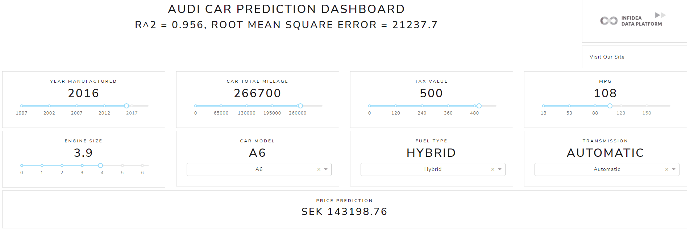

# Car Price Prediction Dashboard 



how to run (docker and docker-compose installed)
```
docker-compose up -d --build 
```
services: 
- backend (swagger): http://localhost:8032/docs or in remote server http://\<ip-address\>:8032/docs
- frontend: http://localhost:8033 or in remote server http://\<ip-address\>:8033 

## Machine Learning Performance 

R^2 = 0.956, Root Mean Square Error = 2454.1, means the prediction price has average error of plus minus 2454.1 
